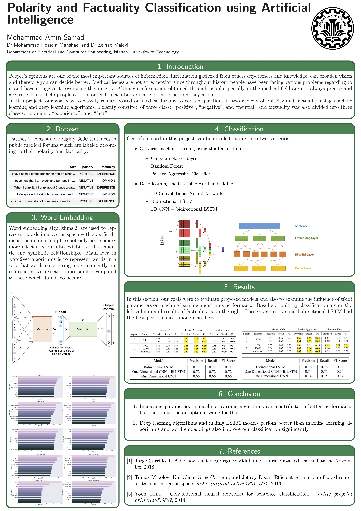

# bs-thesis
Sentiment Analysis and Factuality classification of medical conversations on based on [eDisease dataset](https://zenodo.org/record/1479354#.XYIb-5MzZ-U). Full English report [here](https://github.com/aminsmd/bs-thesis/blob/master/BS%20Thesis.pdf)

# Dataset
Polarity classes:
* POSITIVE
* NEGATIVE
* NEUTRAL

Factuality classes:
* EXPERIENCE
* OPINION
* FACT

# Classifiers
## Machine learning
Feature extraction was done using tf-idf algorithm. Machine learning models used:
* Gaussian Naive Bayes
* Random Forest
* Passive Aggressive

## Deep learning
### Word vector representation
Word vectors were trained based on medical text and also forums conversations text using [gensim python module](https://radimrehurek.com/gensim/)
### Deep learning architectures
* 1 Dimensional CNN Model based on [Convolutional Neural Networks for Sentence Classification, Yoon Kim](https://arxiv.org/abs/1408.5882)
* Deep Bidirectional RNN with LSTM cells
* 1 Layer of 1 Dimensional CNN + Deep RNN Layer

# Poster

